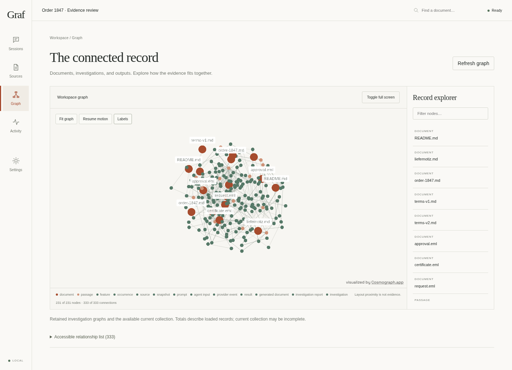
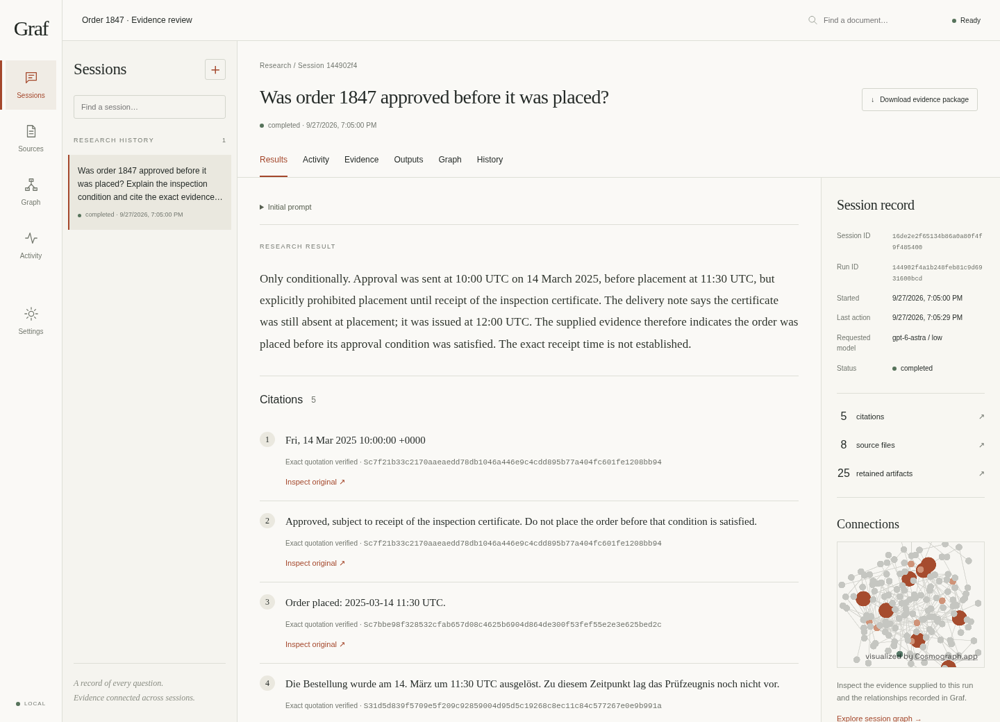
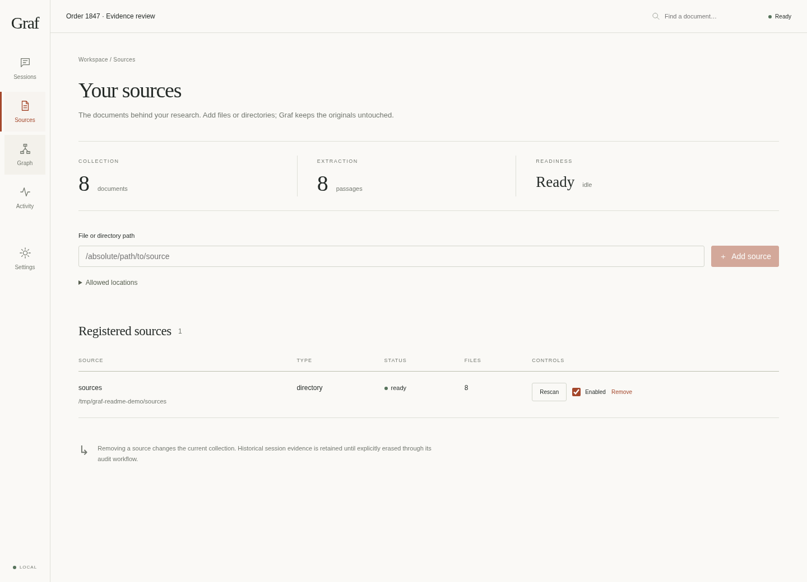
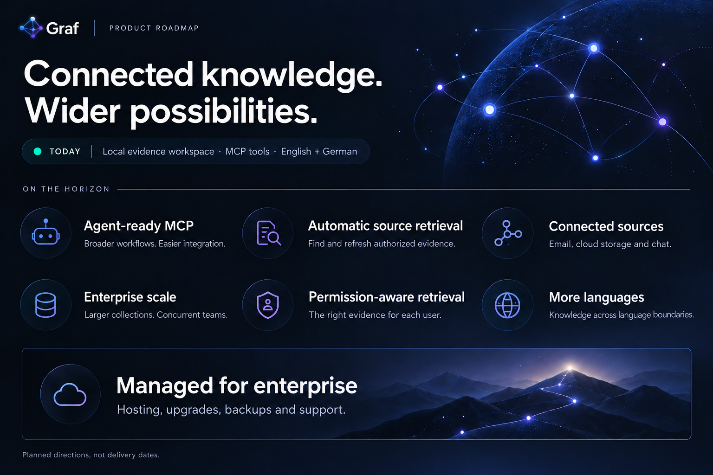

<p align="center">
  
</p>

<h3 align="center">Turn a folder of documents into an investigation you can trace.</h3>

<p align="center">
  Bring your sources together. Follow their connections.<br>
  Ask better questions—and keep the evidence behind every answer.
</p>

<p align="center">
  <a href="docs/INSTALL.md"><strong>Get started →</strong></a> &nbsp;·&nbsp;
  <a href="docs/USER-MANUAL.md">Explore the guide</a> &nbsp;·&nbsp;
  <a href="https://github.com/cogniloom/Graf/releases">Releases</a> &nbsp;·&nbsp;
  <a href="docs/BENCHMARKS.md">Benchmarks</a>
</p>

<p align="center">
  
  
  <a href="THIRD_PARTY.md"></a>
</p>



<p align="center"><sub>Real Graf interface with the bundled fictional demonstration collection. Screenshots show the current source build.</sub></p>

## From scattered files to connected evidence

A contract changes. An email adds a condition. A later document tells a different story.
Graf helps you bring those pieces together, ask questions across them, and return to
the source when a detail matters.

**Build your collection.** Add individual files or directories. See indexing progress,
processing gaps, and when your sources are ready. Originals stay untouched.

**Connect meaning across languages.** Link English and German dates, amounts, and
terms to shared concepts while preserving the original wording.

**Keep the qualifications in view.** Extract supported approval, payment, and
cancellation statements with their negation, conditions, and uncertainty. Bring
contrary statements and repeated-source signals into the evidence an AI receives.

**Follow connections with LadybugDB.** Graf uses the embedded graph database for
fast local relationship traversal during retrieval.

**Investigate in one place.** Start a session from the dashboard, follow its activity,
revisit earlier work, and continue with a linked follow-up. Graf retains the prompt,
supplied evidence, observable agent output, and generated documents.

**Explore the graph.** Zoom into documents, passages, and relationships with Cosmograph.
Open a session graph to distinguish supplied or cited evidence from surrounding
context, then expand it for closer inspection.

**Take the evidence with you.** Download a package containing retained sources,
results, generated documents, and signed integrity records. Verify it independently
with Graf's offline verifier.

[See how the knowledge algorithms work—with diagrams, examples, and current limits →](docs/KNOWLEDGE_VISUAL_GUIDE.md)

## An answer is the beginning of the review



See the answer alongside exact quotations. Open the original, inspect which passages
were supplied, and keep track of what remains unreviewed. Add an attributed note or
create a new version of an output without overwriting its history.

When your collection is still indexing, Graf makes that visible. You can explicitly
choose an available partial snapshot, and the session preserves that limitation.

[Explore investigations, outputs, and evidence packages →](docs/INVESTIGATIONS.md)

## Your sources. A visible state of readiness.



Keep the collection under your control: add, rescan, enable, disable, or remove
sources from the workspace. Readiness follows the source revision, so changes do not
silently masquerade as current evidence.

## History worth keeping

Graf uses content hashes, an append-only ledger, and signed checkpoints to make
changes detectable. Corrections create new versions. Withdrawals record a reason.
Authorized erasure has an impact preview, attribution, and a retained audit trail.

A signature establishes integrity under a key; it does not establish that an answer
is true or guarantee court admissibility. Independently retained keys and checkpoints
matter. [Read the integrity and erasure contract →](docs/INVESTIGATIONS.md#verification-and-trust)

## Local foundation. An explicit AI boundary.

Automatic knowledge enrichment runs locally without LLM calls. Interpretations
stay linked to their sources, with ambiguity and coverage gaps visible.
English and German share dates and operational concepts, including mixed-language
documents. The graph retains attributed claims, stated validity, reversible
identity comparisons, possible source dependence and unclear audio intervals.
[Knowledge-layer capabilities and technical details →](docs/AUTOMATIC_KNOWLEDGE.md)

Indexing and retrieval run locally without generative-model calls or API keys.
The web interface and graph assets are served from your own machine.

Investigations currently use your **Codex subscription login**. Supplied evidence
may be sent to its provider. Graf owns the session history and artifacts, with a
replaceable adapter boundary for future agents. [Privacy and integration details →](docs/CODEX.md)

## Try it with fictional evidence

On a prepared Linux machine, from a release archive or source checkout:

```sh
./graf install --demo
./graf open
```

Then ask in **Sessions**:

> Was order 1847 approved before it was placed? Cite the evidence and explain the conditions.

Setup needs Python, uv, Docker Compose, and space for local model weights. Source
checkouts also need Node.js. See [installation requirements](docs/INSTALL.md),
[release verification](docs/RELEASING.md), and the [Codex setup guide](docs/CODEX.md).

## See the measurements

Explore the measured document and source-code pilots, native Codex comparisons, and
comparisons with TrustGraph, LightRAG, Cognee, and Graphiti. Full tables, protocols,
receipts, and limitations live together in the [benchmark results guide](docs/BENCHMARKS.md).
These are scoped experiments, not universal accuracy or performance promises.

## Where Graf is heading

From a local evidence workspace to connected, permission-aware knowledge for
teams and agents. These are planned directions, not dated release commitments.



| Direction | What comes next |
|---|---|
| **Full MCP toolset** | Broader product-workflow coverage, easier setup, and verified interoperability across MCP-compatible LLM agents. |
| **Automatic source retrieval** | Discover and fetch relevant evidence from user-authorized locations, then keep it up to date. |
| **Online sources** | Connect email providers, cloud storage, and chatrooms, retaining source history and access metadata. |
| **Enterprise scalability** | Larger collections and concurrent teams, with measured capacity, resilient ingestion, and efficient storage and queries. |
| **Managed enterprise offering** | Managed hosting, upgrades, backups, monitoring, and support for enterprise customers. |
| **Permission-aware retrieval** | Enforce each user's source permissions across search, graph traversal, citations, and cached results, including access revocation. |
| **More languages** | Extend extraction and shared concepts beyond English and German, with language-specific evaluation and visible uncertainty. |

**MCP already exists:** Graf exposes discovery, knowledge queries, original-source
reads, graph traversal, and review tools over local stdio.
[Connect an MCP client →](evidencekg/README.md#mcp-tools)
The roadmap expands this foundation; universal agent compatibility and full
product-workflow coverage are not yet established.

Today, Graf targets one local owner. Registered files and folders are watched for
changes; automatic discovery of new source locations and live provider connectors
remain planned. Multi-user source permissions, enterprise capacity, and managed
hosting also remain roadmap work. See the [visual knowledge guide](docs/KNOWLEDGE_VISUAL_GUIDE.md) for
the algorithms and their current limits.

---

[User manual](docs/USER-MANUAL.md) · [Operations & backups](docs/OPERATIONS.md) ·
[Architecture](docs/ARCHITECTURE.md) · [Verification](docs/VERIFICATION.md) ·
[Security](SECURITY.md) · [Developer documentation](evidencekg/README.md)

Graf's original code is [MIT licensed](LICENSE). The included **Cosmograph component
is CC BY-NC 4.0 for non-commercial use**; commercial use requires appropriate rights.
See [third-party notices](THIRD_PARTY.md). Current support targets one local owner on Linux.

Supported source types and extraction limits are documented in the [file format matrix](docs/FILE_FORMATS.md).
