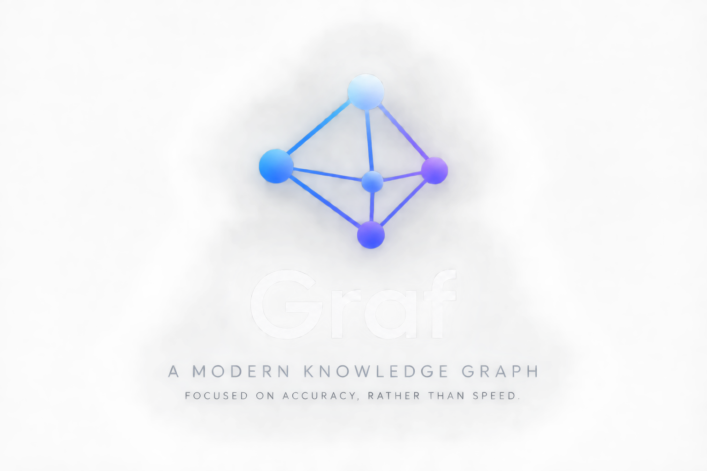
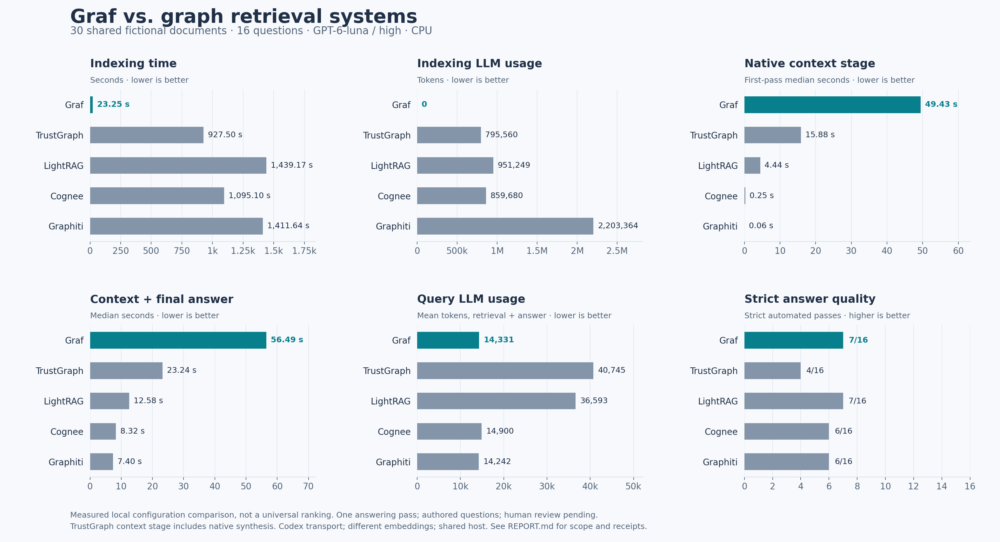
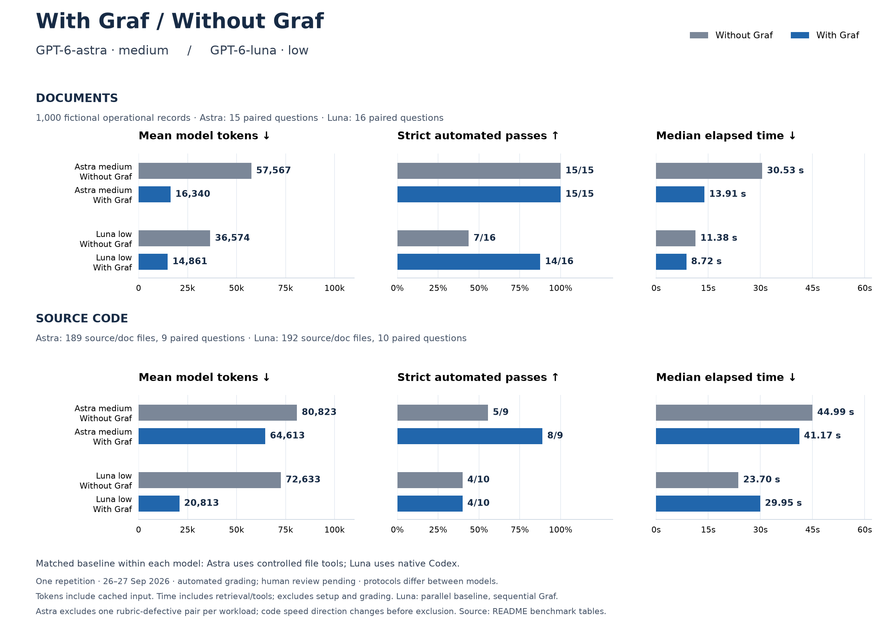

<p align="center">
  
</p>

<p align="center">
  <a href="https://github.com/cogniloom/Graf/actions/workflows/release.yml"></a>
  <a href="https://github.com/cogniloom/Graf/releases"></a>
  <a href="docs/INSTALL.md"></a>
  <a href="evidencekg/pyproject.toml"></a>
  <a href="LICENSE"></a>
  <a href="THIRD_PARTY.md"></a>
</p>

<p align="center">
  <strong>Your documents. Their connections. Evidence you can trace.</strong><br>
  A local evidence workspace with an interactive graph and a Codex research assistant.
</p>

<p align="center">
  <a href="#quick-start">Quick start</a> &nbsp;·&nbsp;
  <a href="docs/USER-MANUAL.md">User manual</a> &nbsp;·&nbsp;
  <a href="docs/CODEX.md">Codex plugin</a> &nbsp;·&nbsp;
  <a href="https://github.com/cogniloom/Graf/releases">Releases</a>
</p>

---

## Follow the evidence

Add documents, explore their relationships in Cosmograph, and ask Codex to investigate with traceable source passages. Graf combines exact identifiers, lexical search, local multilingual embeddings, graph expansion and local reranking to help you find connected evidence.

Candidate worksets stay available for continued review. Extraction gaps stay visible. A short search result is never presented as proof that you have seen everything.

**Python-only code enrichment (experimental).** Graf's optional source-code relationship enrichment is currently optimized for Python. Other languages retain their retrieved source passages without this function/caller/callee enrichment. Support for additional languages is planned. Accuracy gains have been measured on one Python development benchmark; they are not yet validated across repositories. See the [code enrichment guide](benchmarks/CODE_CONTEXT.md).

| Bring your sources | Explore the connections | Investigate with context |
| :--- | :--- | :--- |
| Add files or directories. Rescan, pause or resume processing while originals remain untouched. | Navigate the interactive graph, inspect documents, or use the accessible document list. | Ask Codex to search connected evidence, continue candidate worksets and read source passages through local MCP tools. |

| Stay informed | Keep control |
| :--- | :--- |
| Follow durable jobs, processing phases, failures and readiness under **Activity**. | Start and stop the application, inspect status, back up your workspace and verify a restore. |

### Local processing, an explicit research boundary

Graph construction and retrieval do not call a generative model. PostgreSQL runs in Docker Compose; the application and ranking worker run on your computer. The dashboard and its graph assets work locally after installation. **No API key is required for indexing or retrieval.**

> [!IMPORTANT]
> Codex reasoning uses your configured Codex provider and can transmit the evidence you request. See the [Codex guide](docs/CODEX.md) for the privacy boundary.

## Graf vs. TrustGraph, LightRAG, Cognee and Graphiti

**Measured configuration pilot · GPT-6-luna, high reasoning · 27 September 2026.** We ran all five native systems on the same **30 fictional operational documents and 16 questions**, with one answering pass and two exact-query context repeats on a shared CPU workstation.

Graf had the shortest measured indexing interval and used **no generative calls for indexing**. Its first-pass CPU context retrieval was slower than the other tested configurations. Graphiti had the lowest median context-plus-answer time; Graf and LightRAG tied on strict automated passes. This small pilot does not establish a general product ranking.

| System | Indexing interval ↓ | Index LLM tokens ↓ | Native context median ↓ | Context + answer median ↓ | Mean query tokens ↓ | Strict passes ↑ |
|---|---:|---:|---:|---:|---:|---:|
| **Graf** | 23.25 s | 0 | 49.43 s | 56.49 s | 14,331 | 7/16 |
| **TrustGraph** | 927.50 s | 795,560 | 15.88 s | 23.24 s | 40,745 | 4/16 |
| **LightRAG** | 1,439.17 s | 951,249 | 4.44 s | 12.58 s | 36,593 | 7/16 |
| **Cognee** | 1,095.10 s | 859,680 | 0.25 s | 8.32 s | 14,900 | 6/16 |
| **Graphiti** | 1,411.64 s | 2,203,364 | 0.06 s | 7.40 s | 14,242 | 6/16 |

[](benchmarks/results/2026-09-27-competitors/REPORT.md)

Strict passes require correctness, completeness against the full authored reference, source support, valid verbatim citations and appropriate abstention. The judge can penalize omitted contextual details beyond a concise direct answer; this is not a human-adjudicated accuracy rate. The report separates those checks: for example, Graf had **15/16 judge-correct answers, 16/16 valid-citation responses and 7/16 strict passes**. It delivered all **29/29 designated reference quotations**; this measures the authored evidence set, not exhaustive retrieval recall. Human adjudication is pending.

**How to read this comparison:** Graf uses its BGE embedding/reranking models; competitors use MiniLM embeddings. All generation requests use the same Luna/high model through an experimental Codex subscription transport, whose startup/instruction overhead and adapter-specific context formats affect time and tokens. These are not native provider API costs or large-corpus scalability results. TrustGraph's context stage includes native synthesis before the shared final answer; both are counted, although ordinary TrustGraph use need not generate two answers. Its indexing interval includes a 30-second readiness check.

The full report includes first-pass and repeated-context median/p95, calls and input/cached/output tokens by stage, source coverage, context truncation, partial resource diagnostics and retained integration failures. Graf's exact-repeat context median was **0.020 s**; this is warm retrieval only, not a repeated full-answer measurement. Three failed Cognee setup attempts used **103 calls / 1,421,014 tokens**, separately from its successful configuration; the successful run includes native JSON-validation correction. LightRAG's indexing start overlapped two pending TrustGraph smoke calls (2.799 s of recorded queue wait).

[**Full comparison and limitations**](benchmarks/results/2026-09-27-competitors/REPORT.md) · [**All 80 query measurements**](benchmarks/results/2026-09-27-competitors/per-query.csv) · [**Answers and judge rationales**](benchmarks/results/2026-09-27-competitors/answers.json) · [**Machine-readable summary**](benchmarks/results/2026-09-27-competitors/summary.json) · [**Methodology and reproduction**](benchmarks/competitors/README.md)

## Graf benchmarks

[**Compare Graf with every native Codex model and reasoning level →**](#graf-versus-native-codex-every-model-and-reasoning-level)

**Less searching. More evidence in the first model response.** Graf retrieves relevant passages before GPT-6-astra answers, reducing the model turns needed to find and read evidence. We measured that workflow against the same model using file search and reading without a knowledge graph.

| Document token reduction | Document median time reduction | Code answers passing automated review |
|:---:|:---:|:---:|
| **71.6% fewer** | **54.4% lower** | **8/9 with Graf · 5/9 baseline** |
| 1,000 fictional operational records | 30.53 s → 13.91 s | 189 real source/doc files |

*Measured pilot · 26 September 2026 · one repetition · same-model automated grading · two paired rubric exclusions.* These figures describe the tested workloads. Code latency is sensitive to the exclusions; it does not establish a general code-speed advantage.

[](docs/assets/graf-model-comparison.svg)

**Compare within each model:** Astra medium uses the controlled file-search baseline; Luna low uses native Codex. Each pair shares its questions and sources, but the two models use different protocols and denominators. Graf reduced mean tokens in all four comparisons; Luna's code pass count stayed at 4/10 while its median time increased. One repetition, automated grading, human review pending. [Exact values and methodology below](#graf-versus-native-codex-every-model-and-reasoning-level) · [Rebuild this chart](benchmarks/render_model_comparison.py).

[**Full report**](benchmarks/results/2026-09-26/REPORT.md) · [**All 52 original trials**](benchmarks/results/2026-09-26/per-case.csv) · [**Methodology**](benchmarks/METHODOLOGY.md) · [**Run it yourself**](benchmarks/README.md)

### Same model, measured end to end

Both arms requested **GPT-6-astra, medium effort**, with a six-response limit. The baseline had controlled literal file search and bounded reading. Graf had those same tools plus initial context from the actual hybrid engine: lexical retrieval, local embeddings, graph/structural context and reranking. This tests the whole retrieval stack, not graph edges in isolation or an unrestricted native Codex session.

| Workload | Approach | Mean model tokens ↓ | Mean uncached input ↓ | Median elapsed ↓ | Strict automated passes ↑ |
|---|---|---:|---:|---:|---:|
| **1,000 documents** | File-search baseline | 57,567 | 31,851 | 30.53 s | 15/15 |
| 15 valid question pairs | **Graf + file tools** | **16,340** | **9,386** | **13.91 s** | **15/15** |
| **189 source/doc files** | File-search baseline | 80,823 | 43,704 | 44.99 s | 5/9 |
| 9 valid question pairs | **Graf + file tools** | **64,613** | **41,846** | **41.17 s** | **8/9** |

Model tokens include cached input and output, measured from actual subscription receipts. They are not dollar-cost estimates. Elapsed time includes retrieval, tool execution, process startup and model/network wait. A strict pass requires correctness, completeness, source support, valid verbatim citations and appropriate abstention. Human adjudication is pending.

The document corpus contains **9,946 text lines** of fictional operational records: amendments, invoices, incident reviews, conflicting policies, multilingual correspondence and missing facts. The real code corpus contains **31,039 physical text lines** across source, configuration and documentation, with questions about cross-module behavior, retries, parser failures and snapshot isolation. These are not executable-line counts or million-line repository results.

### Graf versus native Codex: every model and reasoning level

The tables below show **both Graf runs alongside all 35 tested native Codex configurations**, across documentation and source-code questions. **32 configurations completed both workloads; 835 native answers were graded.** Native Codex used its own file/shell tools, with no Graf, MCP, plugins, personal skills or memory. GPT-6-astra high, max and ultra were excluded as requested; xhigh was included.

For the same requested model and effort, **GPT-6-astra medium**, Graf used **16,340 mean tokens for documents** versus **56,113 for native Codex**, with **100% strict passes in both runs**. On code, Graf used **64,613 mean tokens** versus **75,524 for native Codex**; strict passes were **8/9 for Graf** and **10/10 for native Codex**. The tables include every other model and effort, including configurations that performed better or worse.

Rows are grouped by **model family, then reasoning effort** (low → medium → high → xhigh → max → ultra). Results with and without Graf sit together within each model/effort group. The **Workflow** column identifies how each result was measured:

- **Graf · controlled pilot** — GPT-6-astra medium with hybrid retrieval plus controlled file tools and a six-response limit. Its matching baseline is **Controlled · no Graf**. This pilot has 15 valid document and 9 valid code questions, and 189 source/doc files.
- **Graf · native Codex** — GPT-6-luna low with 12 question-only hybrid passages supplied before the first native response; native file/shell tools remain available. It uses the exact same frozen sources, 16 document and 10 code questions, model/effort and grader as its **Native · no Graf** counterpart (192 source/doc files).
- **Native · no Graf** — vanilla Codex's own file/shell workflow, with a 20-minute timeout and no Graf or MCP.

**Luna-low follow-up:** Graf increased document strict passes from **7/16 to 14/16**, with **59.4% fewer tokens**. Code stayed at **4/10**, with **71.3% fewer tokens**; two answers improved and two regressed. Both Graf workflows include retrieval in their reported timing. The Astra pilot and native matrix differ in controller and denominators; Luna uses matched questions and sources, but its Graf run was sequential while its baseline came from the parallel matrix.

**Reading the numbers:** strict passes require correctness, completeness, source support, exact quotations and appropriate abstention. Tokens include all accounted native child sessions. **Total tokens = input + output**; cached input is already included in input. Mean tokens include unsuccessful graded answers. Times are seconds, excluding separate grading and Graf's one-time setup costs (listed below). Total time is the sum of case durations, not the parallel batch's wall-clock duration.

#### Documents — 1,000 operational records

| Model | Effort | Workflow | Strict passes ↑ | Mean tokens ↓ | Input tokens | Cached input | Output tokens | Total tokens | Median time (s) ↓ | Total time (s) |
|---|---|---|---:|---:|---:|---:|---:|---:|---:|---:|
| gpt-6-astra | low | Native · no Graf | 16/16 (100.0%) | 54,829 | 870,435 | 600,192 | 6,829 | 877,264 | 23.02 | 352.40 |
| gpt-6-astra | medium | Native · no Graf | 16/16 (100.0%) | 56,113 | 890,971 | 623,232 | 6,837 | 897,808 | 21.32 | 352.65 |
| gpt-6-astra | medium | Controlled · no Graf | 15/15 (100.0%) | 57,567 | 858,944 | 381,184 | 4,565 | 863,509 | 30.53 | 476.91 |
| gpt-6-astra | medium | **Graf · controlled pilot** | 15/15 (100.0%) | 16,340 | 241,778 | 100,992 | 3,324 | 245,102 | 13.91 | 218.77 |
| gpt-6-astra | xhigh | Native · no Graf | 16/16 (100.0%) | 69,168 | 1,095,305 | 748,800 | 11,381 | 1,106,686 | 29.76 | 490.40 |
| gpt-6-sol | low | Native · no Graf | 16/16 (100.0%) | 49,037 | 777,836 | 531,968 | 6,755 | 784,591 | 15.99 | 271.27 |
| gpt-6-sol | medium | Native · no Graf | 15/16 (93.8%) | 65,122 | 1,032,562 | 806,528 | 9,391 | 1,041,953 | 19.42 | 381.69 |
| gpt-6-sol | high | Native · no Graf | 16/16 (100.0%) | 63,989 | 1,012,482 | 772,736 | 11,335 | 1,023,817 | 22.00 | 336.57 |
| gpt-6-sol | xhigh | Native · no Graf | 14/16 (87.5%) | 70,114 | 1,108,047 | 849,024 | 13,769 | 1,121,816 | 23.72 | 459.81 |
| gpt-6-sol | max | Native · no Graf | 16/16 (100.0%) | 73,247 | 1,152,513 | 886,400 | 19,444 | 1,171,957 | 30.93 | 735.78 |
| gpt-6-sol | ultra | Native · no Graf | Halted | — | — | — | — | — | — | — |
| gpt-6-luna | low | Native · no Graf | 7/16 (43.8%) | 36,574 | 581,258 | 403,712 | 3,934 | 585,192 | 11.38 | 153.25 |
| gpt-6-luna | low | **Graf · native Codex** | 14/16 (87.5%) | 14,861 | 233,942 | 161,024 | 3,831 | 237,773 | 8.72 | 154.98 |
| gpt-6-luna | medium | Native · no Graf | 14/16 (87.5%) | 59,767 | 948,504 | 702,208 | 7,772 | 956,276 | 15.11 | 252.20 |
| gpt-6-luna | high | Native · no Graf | 15/16 (93.8%) | 62,644 | 991,916 | 742,656 | 10,389 | 1,002,305 | 17.59 | 296.61 |
| gpt-6-luna | xhigh | Native · no Graf | 15/16 (93.8%) | 66,765 | 1,048,828 | 814,080 | 19,407 | 1,068,235 | 32.91 | 536.52 |
| gpt-6-luna | max | Native · no Graf | 15/16 (93.8%) | 62,804 | 982,075 | 729,600 | 22,792 | 1,004,867 | 35.10 | 591.18 |
| gpt-5.6-sol | low | Native · no Graf | 16/16 (100.0%) | 43,604 | 689,123 | 415,104 | 8,536 | 697,659 | 16.84 | 267.57 |
| gpt-5.6-sol | medium | Native · no Graf | 15/16 (93.8%) | 53,243 | 842,229 | 510,592 | 9,656 | 851,885 | 16.89 | 277.74 |
| gpt-5.6-sol | high | Native · no Graf | 14/16 (87.5%) | 52,014 | 821,718 | 548,736 | 10,510 | 832,228 | 19.59 | 303.58 |
| gpt-5.6-sol | xhigh | Native · no Graf | 15/16 (93.8%) | 66,621 | 1,051,198 | 721,664 | 14,742 | 1,065,940 | 28.68 | 448.44 |
| gpt-5.6-sol | max | Native · no Graf | 15/16 (93.8%) | 76,494 | 1,202,182 | 893,952 | 21,714 | 1,223,896 | 32.61 | 545.28 |
| gpt-5.6-sol | ultra | Native · no Graf | Halted | — | — | — | — | — | — | — |
| gpt-5.6-terra | low | Native · no Graf | 13/16 (81.2%) | 53,547 | 848,046 | 622,336 | 8,699 | 856,745 | 16.36 | 261.51 |
| gpt-5.6-terra | medium | Native · no Graf | 16/16 (100.0%) | 56,433 | 893,017 | 621,312 | 9,904 | 902,921 | 17.64 | 284.15 |
| gpt-5.6-terra | high | Native · no Graf | 16/16 (100.0%) | 59,596 | 943,255 | 645,632 | 10,286 | 953,541 | 18.19 | 299.01 |
| gpt-5.6-terra | xhigh | Native · no Graf | 15/16 (93.8%) | 65,456 | 1,034,615 | 779,776 | 12,681 | 1,047,296 | 20.54 | 340.17 |
| gpt-5.6-terra | max | Native · no Graf | 16/16 (100.0%) | 100,693 | 1,577,072 | 1,239,296 | 34,016 | 1,611,088 | 42.58 | 733.28 |
| gpt-5.6-terra | ultra | Native · no Graf | Halted | — | — | — | — | — | — | — |
| gpt-5.6-luna | low | Native · no Graf | 15/16 (93.8%) | 56,432 | 892,849 | 579,840 | 10,067 | 902,916 | 20.74 | 322.20 |
| gpt-5.6-luna | medium | Native · no Graf | 13/16 (81.2%) | 78,207 | 1,238,524 | 784,640 | 12,787 | 1,251,311 | 21.67 | 369.17 |
| gpt-5.6-luna | high | Native · no Graf | 12/16 (75.0%) | 77,334 | 1,220,240 | 844,032 | 17,099 | 1,237,339 | 27.66 | 441.83 |
| gpt-5.6-luna | xhigh | Native · no Graf | 14/16 (87.5%) | 86,186 | 1,356,465 | 950,784 | 22,505 | 1,378,970 | 33.12 | 589.71 |
| gpt-5.6-luna | max | Native · no Graf | 14/16 (87.5%) | 98,583 | 1,539,881 | 1,063,680 | 37,448 | 1,577,329 | 52.59 | 828.82 |
| gpt-5.5 | low | Native · no Graf | 15/16 (93.8%) | 49,918 | 784,594 | 582,144 | 14,089 | 798,683 | 22.45 | 352.50 |
| gpt-5.5 | medium | Native · no Graf | 16/16 (100.0%) | 59,774 | 937,064 | 685,056 | 19,315 | 956,379 | 27.88 | 464.47 |
| gpt-5.5 | high | Native · no Graf | 15/16 (93.8%) | 81,126 | 1,271,571 | 888,832 | 26,453 | 1,298,024 | 38.20 | 578.88 |
| gpt-5.5 | xhigh | Native · no Graf | 16/16 (100.0%) | 94,251 | 1,473,309 | 1,107,456 | 34,707 | 1,508,016 | 46.58 | 759.14 |

#### Source code — real repository files

| Model | Effort | Workflow | Strict passes ↑ | Mean tokens ↓ | Input tokens | Cached input | Output tokens | Total tokens | Median time (s) ↓ | Total time (s) |
|---|---|---|---:|---:|---:|---:|---:|---:|---:|---:|
| gpt-6-astra | low | Native · no Graf | 9/10 (90.0%) | 66,238 | 654,361 | 472,320 | 8,018 | 662,379 | 32.91 | 358.63 |
| gpt-6-astra | medium | Native · no Graf | 10/10 (100.0%) | 75,524 | 746,340 | 561,280 | 8,901 | 755,241 | 29.03 | 366.63 |
| gpt-6-astra | medium | Controlled · no Graf | 5/9 (55.6%) | 80,823 | 722,811 | 329,472 | 4,592 | 727,403 | 44.99 | 402.99 |
| gpt-6-astra | medium | **Graf · controlled pilot** | 8/9 (88.9%) | 64,613 | 576,290 | 199,680 | 5,226 | 581,516 | 41.17 | 490.35 |
| gpt-6-astra | xhigh | Native · no Graf | 10/10 (100.0%) | 90,280 | 883,768 | 612,992 | 19,032 | 902,800 | 65.96 | 701.37 |
| gpt-6-sol | low | Native · no Graf | 9/10 (90.0%) | 77,901 | 770,098 | 587,136 | 8,912 | 779,010 | 27.96 | 274.55 |
| gpt-6-sol | medium | Native · no Graf | 9/10 (90.0%) | 102,583 | 1,012,026 | 779,264 | 13,802 | 1,025,828 | 45.33 | 479.65 |
| gpt-6-sol | high | Native · no Graf | 8/10 (80.0%) | 121,626 | 1,197,261 | 937,216 | 18,995 | 1,216,256 | 48.09 | 475.49 |
| gpt-6-sol | xhigh | Native · no Graf | 9/10 (90.0%) | 171,608 | 1,688,425 | 1,386,752 | 27,659 | 1,716,084 | 57.65 | 625.73 |
| gpt-6-sol | max | Native · no Graf | 9/10 (90.0%) | 145,787 | 1,418,588 | 1,107,840 | 39,286 | 1,457,874 | 82.69 | 974.74 |
| gpt-6-sol | ultra | Native · no Graf | Halted | — | — | — | — | — | — | — |
| gpt-6-luna | low | Native · no Graf | 4/10 (40.0%) | 72,633 | 716,650 | 514,304 | 9,678 | 726,328 | 23.70 | 237.25 |
| gpt-6-luna | low | **Graf · native Codex** | 4/10 (40.0%) | 20,813 | 203,837 | 55,552 | 4,297 | 208,134 | 29.95 | 302.69 |
| gpt-6-luna | medium | Native · no Graf | 5/10 (50.0%) | 91,844 | 907,177 | 675,840 | 11,258 | 918,435 | 27.20 | 293.98 |
| gpt-6-luna | high | Native · no Graf | 9/10 (90.0%) | 123,873 | 1,222,106 | 950,272 | 16,622 | 1,238,728 | 39.12 | 400.79 |
| gpt-6-luna | xhigh | Native · no Graf | 8/10 (80.0%) | 176,741 | 1,723,973 | 1,359,104 | 43,441 | 1,767,414 | 86.84 | 957.65 |
| gpt-6-luna | max | Native · no Graf | 9/10 (90.0%) | 182,847 | 1,773,964 | 1,423,872 | 54,504 | 1,828,468 | 115.16 | 1250.38 |
| gpt-5.6-sol | low | Native · no Graf | 7/10 (70.0%) | 78,515 | 773,487 | 540,416 | 11,660 | 785,147 | 31.21 | 314.71 |
| gpt-5.6-sol | medium | Native · no Graf | 7/10 (70.0%) | 120,494 | 1,187,901 | 907,008 | 17,041 | 1,204,942 | 42.35 | 421.11 |
| gpt-5.6-sol | high | Native · no Graf | 7/10 (70.0%) | 127,160 | 1,248,962 | 981,760 | 22,633 | 1,271,595 | 52.27 | 585.56 |
| gpt-5.6-sol | xhigh | Native · no Graf | 7/10 (70.0%) | 212,198 | 2,088,316 | 1,684,864 | 33,661 | 2,121,977 | 62.86 | 799.73 |
| gpt-5.6-sol | max | Native · no Graf | 7/10 (70.0%) | 345,999 | 3,395,681 | 2,904,320 | 64,310 | 3,459,991 | 122.19 | 1366.90 |
| gpt-5.6-sol | ultra | Native · no Graf | Halted | — | — | — | — | — | — | — |
| gpt-5.6-terra | low | Native · no Graf | 8/10 (80.0%) | 116,102 | 1,149,745 | 869,632 | 11,275 | 1,161,020 | 30.51 | 288.01 |
| gpt-5.6-terra | medium | Native · no Graf | 6/10 (60.0%) | 106,283 | 1,050,620 | 799,232 | 12,206 | 1,062,826 | 27.73 | 295.12 |
| gpt-5.6-terra | high | Native · no Graf | 7/10 (70.0%) | 138,988 | 1,374,059 | 1,066,496 | 15,820 | 1,389,879 | 35.14 | 367.73 |
| gpt-5.6-terra | xhigh | Native · no Graf | 9/10 (90.0%) | 185,106 | 1,826,232 | 1,454,592 | 24,832 | 1,851,064 | 51.24 | 553.00 |
| gpt-5.6-terra | max | Native · no Graf | 7/10 (70.0%) | 338,407 | 3,315,797 | 2,844,928 | 68,269 | 3,384,066 | 120.92 | 1363.22 |
| gpt-5.6-terra | ultra | Native · no Graf | Halted | — | — | — | — | — | — | — |
| gpt-5.6-luna | low | Native · no Graf | 5/10 (50.0%) | 109,950 | 1,087,303 | 753,152 | 12,197 | 1,099,500 | 31.79 | 316.05 |
| gpt-5.6-luna | medium | Native · no Graf | 6/10 (60.0%) | 138,469 | 1,367,827 | 950,272 | 16,866 | 1,384,693 | 40.03 | 416.62 |
| gpt-5.6-luna | high | Native · no Graf | 6/10 (60.0%) | 202,586 | 1,996,990 | 1,539,072 | 28,866 | 2,025,856 | 65.18 | 679.25 |
| gpt-5.6-luna | xhigh | Native · no Graf | 6/10 (60.0%) | 340,924 | 3,356,339 | 2,752,768 | 52,899 | 3,409,238 | 108.15 | 1111.45 |
| gpt-5.6-luna | max | Native · no Graf | 6/10 (60.0%) | 440,437 | 4,315,879 | 3,635,200 | 88,487 | 4,404,366 | 156.97 | 1770.11 |
| gpt-5.5 | low | Native · no Graf | 7/10 (70.0%) | 117,279 | 1,153,807 | 894,464 | 18,980 | 1,172,787 | 44.38 | 436.44 |
| gpt-5.5 | medium | Native · no Graf | 9/10 (90.0%) | 157,980 | 1,556,757 | 1,290,240 | 23,042 | 1,579,799 | 52.99 | 514.60 |
| gpt-5.5 | high | Native · no Graf | 7/10 (70.0%) | 231,474 | 2,277,739 | 1,922,048 | 37,006 | 2,314,745 | 77.98 | 792.66 |
| gpt-5.5 | xhigh | Native · no Graf | 10/10 (100.0%) | 207,225 | 2,027,523 | 1,669,632 | 44,731 | 2,072,254 | 93.60 | 916.24 |

**Three halted configurations:** GPT-6-sol ultra, GPT-5.6-sol ultra and GPT-5.6-terra ultra each had an unfinished native child without a final token receipt. Their full-workload scores and totals are unavailable, not zero or estimated. Of 910 scheduled native questions, 835 completed and were graded, 3 failed accounting, and 72 were skipped after their configuration halted. No failed attempt was retried; partial per-case evidence is retained.

**Measurement notes:** the first 29 native attempts were sequential; the rest used up to six concurrent configurations. Per-case data identifies that split; the table's observed timing includes shared-host/provider contention. This is one repetition with authored questions and automated GPT-6-astra medium judging; human review remains pending. Astra-pilot setup and grading costs are documented below; Luna-follow-up setup and grading usage are recorded in its [report and provenance](benchmarks/results/2026-09-27-luna-graf/REPORT.md). Native matrix judging used 13,136,842 input tokens (6,641,664 cached), 89,436 output tokens, and 6,187.38 summed seconds across 835 calls, separately from the answering numbers above.

[**Luna with/without Graf: full comparison**](benchmarks/results/2026-09-27-luna-graf/REPORT.md) · [**Luna exact totals**](benchmarks/results/2026-09-27-luna-graf/summary.csv) · [**Luna per-case results and rationales**](benchmarks/results/2026-09-27-luna-graf/per-case.csv)

[**Exact native totals (CSV)**](benchmarks/results/2026-09-27-native/summary.csv) · [**Every native case and execution cohort**](benchmarks/results/2026-09-27-native/per-case-execution.csv) · [**Report and provenance**](benchmarks/results/2026-09-27-native/REPORT.md) · [**Native methodology**](benchmarks/NATIVE.md)

### Retrieval across 10,000 documents

| Actual hybrid engine | Measured result |
|---|---:|
| Corpus size | **10,000 short documents · 99,946 lines** |
| Complete designated evidence sets retrieved | **16/16** |
| Median retrieval | **1.97 s** |
| p95 retrieval, including first-query model loading | **18.34 s** |
| Result-cache hits | **0** |
| Generative-model calls during retrieval | **0** |

This separate scale probe measures retrieval coverage, **not final-answer accuracy at 10,000 documents**. Increasing the corpus adds distractors while retaining the same questions. [Inspect the scale results →](benchmarks/results/2026-09-26/hybrid-10000-scale.json)

<details>
<summary><strong>Setup costs, grading usage and comparisons where both answers passed</strong></summary>

Indexing and preparation are additional to answer latency. Local model weights were already present; no model download was timed. Initial software installation and database provisioning are excluded.

| Corpus | Ingestion | Hybrid preparation | Generative calls for indexing/preparation |
|---|---:|---:|---:|
| 1,000 documents | 5.95 s | 18.60 s | 0 |
| 189 source/doc files | 1.63 s | 26.34 s | 0 |
| 10,000 documents | 72.56 s | 72.18 s | 0 |

The separate automated judge consumed the following resources, excluded from answering metrics:

| Workload | Judge calls | Input tokens | Output tokens | Summed elapsed |
|---|---:|---:|---:|---:|
| Documents | 32 | 459,361 | 2,680 | 251.9 s |
| Code | 20 | 441,242 | 1,876 | 171.6 s |

For paired questions where **both approaches passed**, Graf saved:

| Workload | Both-pass pairs | Mean tokens saved per pair | Mean seconds saved per pair |
|---|---:|---:|---:|
| Documents | 15 | 41,227 | 17.21 s |
| Code | 5 | 39,672 | 1.56 s |

These subsets explain efficiency at matched observed quality. They do not replace the full accuracy denominators above; unsuccessful answers remain in overall usage and scoring.

</details>

<details>
<summary><strong>All original results, rubric corrections and latency sensitivity</strong></summary>

All **52 answering trials and 52 separate grades completed**. No original results were deleted. Grading exposed two authored-reference defects: `doc-16` incorrectly required abstention for an answerable policy question; `code-03` overstated process-group reaping. Both arms of each question were excluded from the headline comparison, and the corpus builder was corrected for future runs.

| Original workload | Approach | Mean model tokens | Median elapsed | p95 elapsed | Original strict score* |
|---|---|---:|---:|---:|---:|
| 16 document questions | File-search baseline | 56,608 | 30.53 s | 44.97 s | 15/16 |
| 16 document questions | Graf + file tools | 16,351 | 14.09 s | 28.95 s | 15/16 |
| 10 code questions | File-search baseline | 78,949 | 43.85 s | 56.60 s | 5/10 |
| 10 code questions | Graf + file tools | 63,653 | 45.73 s | 97.62 s | 9/10 |

*These scores include defective gold and are retained for audit, not headline accuracy claims.*

**The code median changes direction after the exclusion.** Across all original questions, Graf took longer despite using fewer tokens. Across the valid pairs, its median was lower. A broader repeated experiment is needed before claiming a code-speed advantage.

[Document summaries](benchmarks/results/2026-09-26/documents-summary.json) · [Code summaries](benchmarks/results/2026-09-26/code-summary.json) · [Document paired analysis](benchmarks/results/2026-09-26/documents-quality.json) · [Code paired analysis](benchmarks/results/2026-09-26/code-quality.json)

The paired-analysis JSON retains the original denominators, category results and descriptive question-bootstrap intervals, including the excluded items. The [primary document metrics](benchmarks/results/2026-09-26/documents-primary.json) and [primary code metrics](benchmarks/results/2026-09-26/code-primary.json) apply the stated exclusions.

</details>

<details>
<summary><strong>Earlier retrieval probes and interrupted calibration</strong></summary>

These local probes compare lexical and mechanical compatibility retrieval policies, **not the full hybrid engine or GPT answer accuracy**. Each question was repeated three times with a twelve-passage limit; operating-system caches were not flushed.

| Corpus | Policy | Complete reference sets | Designated-reference recall | Median retrieval | p95 retrieval |
|---|---|---:|---:|---:|---:|
| 1,000 documents | Lexical | 48/48 | 100% | 0.235 s | 0.677 s |
| 1,000 documents | Mechanical | 48/48 | 100% | 0.405 s | 1.106 s |
| 189 source/doc files | Lexical | 9/30 | 27.27% | 0.097 s | 0.201 s |
| 189 source/doc files | Mechanical | 9/30 | 31.82% | 0.344 s | 0.536 s |

An earlier model calibration stopped after 28 completed trials because the model never invoked the optional Graf tool. It cannot establish a Graf treatment effect and is excluded. The measured hybrid protocol supplies timed retrieval before the first response.

An older mechanical/lexical 10,000-document probe stopped after 861.6 seconds without complete aggregates. That interruption provides no per-query latency estimate and is not a result for the current hybrid engine. Its receipts, the calibration and earlier probes remain in the local raw evidence directory.

</details>

### Evidence and limits

Measurements used a shared Linux host with an **AMD Ryzen 9 5950X and NVIDIA RTX 4060 Ti 16 GB**, pinned local models and an isolated PostgreSQL database. The database was removed after measurement. The code corpus captures revision `00be47ad82e0fd126f571062dafd979b60e3a9bf`; source files were exported losslessly to supported text formats, without adding AST or call-graph analysis.

This is a small, authored pilot with one repetition, fictional short documents and same-model automated judging. It does not establish real-customer PDF/OCR accuracy, million-line code performance, or universal speed/cost savings. The CLI records the requested model but does not independently attest the server's effective model identity. Human review and fresh held-out, repeated runs remain necessary for broader marketing claims.

**Verification:** 49 benchmark tests passed. Four existing OCR/MCP failures reproduced on the unchanged base and remain documented. [Verification details](benchmarks/results/VERIFICATION.md) · [Environment](benchmarks/results/2026-09-26/environment.json) · [Reproduction and raw-artifact requirements](benchmarks/results/README.md)

## Quick start

### 1. Prepare your machine

| Requirement | Details |
| :--- | :--- |
| Platform | Linux with Python 3.12+ |
| Tools | [uv](https://docs.astral.sh/uv/getting-started/installation/) and [Docker Engine with Compose](https://docs.docker.com/compose/install/) |
| Disk space | At least **15 GB free** for dependencies and model weights, plus space for documents and retained versions |
| Source checkouts | Node.js 22+ and npm to build the dashboard; release archives include it prebuilt |
| GPU | Optional NVIDIA CUDA support; CPU inference is slower |

Download `graf-X.Y.Z.tar.gz` and its checksum from [GitHub Releases](https://github.com/cogniloom/Graf/releases), then follow the [verification and extraction steps](docs/RELEASING.md). Dependencies and model weights require a substantial initial download.

### 2. Open your first workspace

From an extracted release archive or source checkout:

```sh
./graf install --demo
./graf open
```

The installer generates private credentials, starts PostgreSQL, downloads pinned local models and starts the application. Follow progress under **Activity**. The demo documents are entirely fictional.

<details>
<summary><strong>Use your own documents with an NVIDIA GPU</strong></summary>

<br>

```sh
./graf install --device cuda --allow-root "$HOME/Documents"
./graf sources add "$HOME/Documents/my-case"
./graf open
```

Replace `my-case` with your document directory. Use `--device cpu` for CPU inference. See [Installation](docs/INSTALL.md) for model locations, source permissions and existing workspaces.

</details>

### 3. Connect Codex

Install the plugin after installing the application:

```sh
./graf plugin-install
```

Open a new Codex thread and try this question against the demo:

> Use Graf to investigate whether order 1847 was approved before it was placed. Cite the evidence and explain the conditions.

## Know what “ready” means

A source change gates evidence access until a matching revision is published. **Ready with gaps** means searchable evidence exists, but processing exceptions remain. **Ready** describes processing state, not guaranteed understanding or legal completeness. Research results require human review.

## Go deeper

| Guide | What you’ll find |
| :--- | :--- |
| [Installation](docs/INSTALL.md) | Requirements, CPU/CUDA, paths and first run |
| [User manual](docs/USER-MANUAL.md) | Sources, graph, research and readiness |
| [Codex plugin](docs/CODEX.md) | Installation, tools and privacy boundary |
| [Operations](docs/OPERATIONS.md) | Recovery, backups, upgrades and troubleshooting |
| [Architecture](docs/ARCHITECTURE.md) | Storage, jobs, evidence gates and retrieval |
| [Release guide](docs/RELEASING.md) | Build a clean archive and publish safely |
| [Verification](docs/VERIFICATION.md) | Actual checks and remaining support limits |
| [Benchmarks](benchmarks/README.md) | Reproducible document/code comparisons, measured tokens, latency and supported-answer scoring |
| [Security](SECURITY.md) | Local trust model and vulnerability handling |
| [Third-party notices](THIRD_PARTY.md) | Cosmograph and other dependency licenses |

## License & support

Graf’s original code is [MIT licensed](LICENSE). **The included Cosmograph component is CC BY-NC 4.0 for non-commercial use.** Publishing this repository does not grant commercial rights to Cosmograph. See [third-party notices](THIRD_PARTY.md) and [Cosmograph licensing](https://cosmograph.app/licensing/). This combined distribution is not unrestricted open-source software.

This release targets **a single local owner on Linux**. It is not a public network service or a multi-tenant system. Native macOS, native Windows, WSL2 and unattended production deployments require their own validation.
