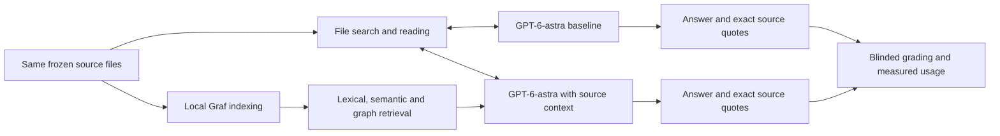

# Graf benchmark

Compare **GPT-6-astra with file search/read** against **the same GPT-6-astra with Graf discovery plus file search/read**. Measure the work required to reach a supported answer, including the cases where Graf does not help.

This is an executable benchmark, not a set of promotional estimates. Measured results and their limits belong together. Start with [the methodology](METHODOLOGY.md). Current measurements are linked in [results](results/README.md).

## Workloads

| Workload | Inputs | Questions |
|---|---|---|
| Operational document archive | 1,000 files by default; configurable to 10,000+ | 16 questions about approved versus requested quantities, effective amendments, invoice reconciliation, incident causality, superseded policies, ambiguous people, bilingual correspondence, contract timing and missing evidence |
| Source-code investigation | Tracked UTF-8 source, configuration and documentation at a captured Git HEAD | 10 questions about snapshot isolation, cross-module ingestion/retrieval, cursor binding, worker failure, citation validation and incomplete extraction |

The operational archive is **fictional, realistic simulation**, with authored evidence and varied templated distractors. It is not customer data. Scaling increases distractors while keeping the same questions; it tests search under load, not additional independent tasks. The code workload uses real implementation files, not generated duplicate code. On the initial checkout it contains 189 files and 31,039 lines; this is not a million-line benchmark.

The code exporter preserves bytes and relative paths, adding `.txt` for file types Graf's parser does not support. It does not build an AST, call graph or symbol index. This makes a current product limitation visible instead of implying native code intelligence.



The proposed benefit is fewer model-driven searches and reads before answering. The measured treatment includes Graf's entire retrieval stack; it does not isolate the contribution of graph edges from lexical search, embeddings or reranking.

## Reproduce

For manual ChatGPT web runs using Google Drive or GitHub, see the
[web benchmark guide](web-guide.md). Generate source-only upload archives,
individual prompts, private reference answers and a results log with
`python3 -m benchmarks.prepare_web .evidencekg-benchmarks/chatgpt-web`.
This is a separate native web/connector comparison; no uploads or model calls
are made during preparation.

Use the repository's Python environment and locked dependencies:

```sh
uv sync --project evidencekg --frozen
export PYTHONPATH=.:evidencekg/src

evidencekg/.venv/bin/python -m pytest benchmarks -q
evidencekg/.venv/bin/ruff check --config evidencekg/pyproject.toml benchmarks

# Each destination must be new. Sources, gold and measurements are separate.
evidencekg/.venv/bin/python -m benchmarks.runner prepare \
  .evidencekg-benchmarks/docs-1000 --kind documents --count 1000
evidencekg/.venv/bin/python -m benchmarks.runner prepare \
  .evidencekg-benchmarks/code --kind code

# Mechanical compatibility engine: useful pilot, not the default Graf product.
evidencekg/.venv/bin/python -m benchmarks.runner run \
  .evidencekg-benchmarks/docs-1000 .evidencekg-benchmarks/docs-core-run \
  --backend core --repeats 3 --max-steps 8
evidencekg/.venv/bin/python -m benchmarks.runner grade \
  .evidencekg-benchmarks/docs-core-run
evidencekg/.venv/bin/python -m benchmarks.runner report \
  .evidencekg-benchmarks/docs-core-run
```

`run` and `grade` consume the existing ChatGPT subscription. They require an authenticated Codex CLI supporting `--ignore-user-config`, `--ephemeral`, JSON events and structured output. They explicitly request `gpt-6-astra` with medium effort; unavailable models, exhausted allowance and failed calls halt the run. There is no API-key, paid-overage or model substitution fallback. Do not treat a stopped run as a complete comparison.

Gold questions are authored for this repository revision. Pointing `--repository` at an unrelated project will fail evidence validation; add a reviewed corpus builder and held-out questions before extending the benchmark to another repository.

### Actual hybrid product

Install the `hybrid` extra and use the documented [Graf hybrid preparation](../evidencekg/HYBRID.md) against an explicitly approved, isolated benchmark PostgreSQL database. Reuse pinned local models where available. Record the whole preparation duration, model download duration if any, device and disk consumption. The runtime must point to this benchmark's snapshot, never an unrelated workspace.

```sh
# Use the interpreter containing the actual local ML dependencies.
PYTHONPATH=evidencekg/src evidencekg/.venv/bin/python -m evidencekg.cli \
  --state .evidencekg-benchmarks/docs-1000/index prepare-hybrid \
  --models /absolute/path/to/pinned/models \
  --database-config /absolute/path/to/approved/benchmark-database.json

PYTHONPATH=.:evidencekg/src evidencekg/.venv/bin/python -m benchmarks.runner run \
  .evidencekg-benchmarks/docs-1000 .evidencekg-benchmarks/docs-hybrid-run \
  --backend hybrid --hybrid-config .evidencekg-benchmarks/docs-1000/index/hybrid.json \
  --repeats 3 --max-steps 8
```

The hybrid arm uses the product's `Runtime`, model verification, PostgreSQL worksets, actual embedding/reranking and cache behavior. No fake model or in-memory substitute is used. Its complete configuration/model identities are captured in `run.json`. Missing preparation fails explicitly.

## Outputs

- `manifest.json`: captured commit, implementation hashes, every source hash, file/line/byte counts, host, ingestion time and index size.
- `questions.json`: question-only execution inputs. `cases.json`: separate answers and exact reference evidence for grading.
- `run.json`: frozen randomized schedule, limits, model request, retrieval identity and initialization costs.
- `trial-NNNN/`: prompt, requested tool operations, actual tool results, raw Codex events, usage receipts, final answer and a hash inventory.
- `grading/`: anonymous judge prompts, raw judge events, strict scores and separate judging usage.
- `summary.json` and `report.md`: derived metrics with explicit denominators and publication limitations.

After grading, generate quality-conditioned comparisons and a blinded review packet:

```sh
PYTHONPATH=.:evidencekg/src evidencekg/.venv/bin/python -m benchmarks.analyze \
  .evidencekg-benchmarks/docs-core-run
PYTHONPATH=.:evidencekg/src evidencekg/.venv/bin/python -m benchmarks.analyze \
  .evidencekg-benchmarks/docs-core-run --review-output /tmp/graf-blinded-review
```

Give reviewers `reviewer-packet.json`; retain `coordinator-key-do-not-share.json` separately. The analysis reports total tokens per strict pass, category-level results, paired token/accuracy intervals and latency on the subset where both arms pass. Failed answers remain in overall accuracy and total usage. These scripts do not automatically publish or certify reviewer judgments.

For a local scale probe without generative calls:

```sh
PYTHONPATH=.:evidencekg/src evidencekg/.venv/bin/python -m benchmarks.retrieval_scale \
  .evidencekg-benchmarks/docs-1000 /tmp/graf-retrieval-scale.json --repeats 3
```

That probe compares the repository's lexical and mechanical retrieval policies using the same question, twelve-passage limit and reference rubric. It reports exact designated-reference coverage, selected text bytes and latency. This is not GPT answer accuracy, token consumption or a pure graph ablation: the ranking policies differ as well.

For the actual hybrid engine at scale, use `benchmarks.hybrid_scale` with the ML-enabled interpreter, a freshly prepared dataset, `--models /path/to/pinned/models` and `--database-config /path/to/approved/benchmark-database.json`. It records each query separately and imposes a 180-second per-query deadline. Run it after answer measurements so GPU work does not distort their latency. It measures retrieval and designated-reference coverage, not final-answer accuracy. The older unjournaled mechanical probe did not complete at 10,000 documents within the observed 861.6 seconds; its interrupted run is retained and supplies no per-query aggregate.

Raw results are preserved on interruption; no automatic retry hides failed attempts. The current runner requires a new output directory to rerun. Deliberately changed sources, questions or implementation require a newly prepared dataset. Reporting verifies corpus/run bindings, trial identities, raw receipts and aggregates; these local hashes detect drift, not malicious rewriting of an entire unsigned artifact chain.

## Publication

Use `core` results only for the mechanical graph engine. Use `hybrid` results for the full retrieval stack, and describe the baseline as the **controlled file-search agent**. Neither arm is an unmodified native Codex CLI session: a fixed JSON controller gives both identical tool and answer limits.

Do not publish an overall speed/token saving without supported-answer accuracy, paired denominators, setup costs, corpus provenance and repeat counts. Automatic grading is provisional. Independent human review and a fresh held-out corpus remain required before a marketing claim; `publication_ready` deliberately remains false. Copying or publishing results is a separate operator action.
