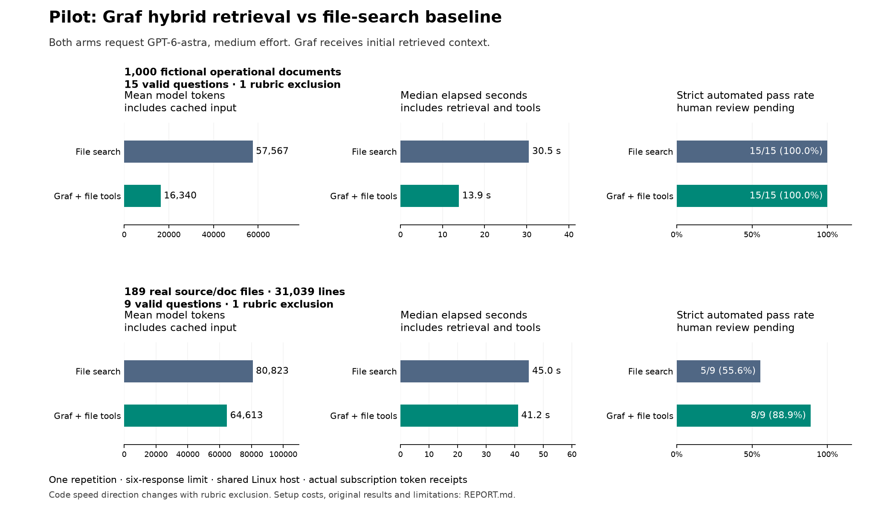

# Graf benchmark: measured pilot

These are observed results from the actual hybrid retrieval engine and real GPT-6-astra subscription calls. The baseline uses a controlled file-search/read agent. Both arms requested the same model, medium effort and a six-response limit. One repetition was run per question. The headline document comparison includes 15 valid question pairs; one defective document rubric item and one code rubric item were excluded symmetrically after grading exposed them; code headlines use 9 valid pairs.

| Workload | Arm | Mean total model tokens | Mean uncached input | Median elapsed | Strict automated passes |
|---|---|---:|---:|---:|---:|
| Documents | File search | 57,567 | 31,851 | 30.53 s | 15/15 |
| Documents | Graf + file tools | 16,340 | 9,386 | 13.91 s | 15/15 |
| Code | File search | 80,823 | 43,704 | 44.99 s | 5/9 |
| Code | Graf + file tools | 64,613 | 41,846 | 41.17 s | 8/9 |

Total model tokens include cached input and output. They are actual CLI usage, not character-based estimates or dollar charges. Elapsed time includes retrieval, tool work, process startup and model/network wait. Accuracy is strict automated judgment, with independent mechanical citation and abstention gates; it is not human-certified.

## Sensitivity: all original trials

No original trials were discarded from the evidence. Before symmetric rubric exclusions, documents averaged 56,608 vs 16,351 tokens and 30.53 vs 14.09 seconds median (file search vs Graf). Code averaged 78,949 vs 63,653 tokens and 43.85 vs 45.73 seconds median. Original strict scores were 15/16 vs 15/16 documents and 5/10 vs 9/10 code; the incorrect gold makes those accuracy denominators unsuitable for headline claims. The code speed direction changes after exclusion, so no broad code-speed claim is warranted.

## What was tested

- **Documents:** 1,000 fictional short operational records, 9,946 text lines and 548,291 bytes; 16 questions spanning amendments, conflicting policies, reconciliation, chronology, ambiguous identities, multilingual evidence and missing facts.
- **Code:** 189 real source/configuration/documentation files at commit `00be47ad82e0fd126f571062dafd979b60e3a9bf`, with 31,039 physical text lines and 1,398,358 bytes; 10 questions about cross-module behavior and failure paths. This is not 31,039 executable lines or a million-line repository.
- **Engine:** actual Graf hybrid Runtime with pinned local BGE-M3 embeddings, local reranking, graph/structural context and an isolated PostgreSQL database. This measures the whole retrieval stack, not the causal contribution of graph edges alone.
- **Machine:** AMD Ryzen 9 5950X CPU, NVIDIA RTX 4060 Ti 16 GB, Linux; shared host. Model weights already existed. Answering runs were sequential across corpora; the later large-corpus GPU probe did not compete with answering.
- **Protocol:** Graf retrieves the original question before the first model response. Both arms retain file tools. This is a controlled JSON tool loop, not an unrestricted native Codex terminal session.

## Why Graf helped in this pilot

Graf supplies relevant passages before the first model response, which can remove repeated search/read/model turns. This was useful on the short operational-document tasks. The code latency result is sensitive to the rubric exclusion: across all 10 original questions, Graf used fewer tokens but had a higher median latency (45.73 vs 43.85 seconds); across the 9 valid pairs, its median is lower (41.17 vs 44.99 seconds). This is not robust evidence of a general code-speed advantage. Retrieval and local reranking have a cost, and broad code investigation may still need several source reads. These observations support a workload-specific benefit, not an automatic advantage on every repository.

## Setup and evaluation costs

| Workload | Ingestion | Hybrid preparation | Model download |
|---|---:|---:|---:|
| Documents | 5.95 s | 18.60 s | 0 s; weights reused |
| Code | 1.63 s | 26.34 s | 0 s; weights reused |

These setup costs are additional to answer latency. Indexing/preparation made zero generative-model calls but consumed local compute. First queries include lazy model loading. Database provisioning and initial software/model installation are not measured in these setup totals.

- Documents grading: 32 separate judge calls, 459,361 input tokens, 2,680 output tokens and 251.9 summed seconds. These are excluded from answering usage.
- Code grading: 20 separate judge calls, 441,242 input tokens, 1,876 output tokens and 171.6 summed seconds. These are excluded from answering usage.

## Quality-conditioned comparisons

Positive savings below mean file-search usage minus Graf usage. These subsets include only paired questions where both arms passed; overall pass counts above keep the full denominator. The small, authored sample does not support population-wide claims.

| Workload | Both-pass pairs | Mean seconds saved on both-pass subset | Mean total tokens saved on both-pass subset |
|---|---:|---:|---:|
| Documents | 15 | 17.21 s | 41,227 |
| Code | 5 | 1.56 s | 39,672 |

The original JSON analyses retain question-cluster bootstrap intervals and category-level results for all original questions, including the defective items; they are retained as audit artifacts, not the corrected headline comparison. With one repetition and hand-authored tasks, these are descriptive pilot statistics, not a universal speed guarantee.

## Scale and limitations

The real hybrid engine retrieved all 16 original questions against **10,000 short documents / 99,946 lines**. Ingestion took **72.56 s**, hybrid preparation **72.18 s**, median retrieval **1.97 s** and p95 **18.34 s**. It delivered **16/16 complete designated reference sets**, with **0 cached results**. This scale probe made no generative calls and measures retrieval coverage, **not final-answer accuracy at 10,000 documents**.

The earlier tool-availability calibration was stopped after 28 completed trials because the model never invoked Graf. Its receipts and exact source snapshot are retained and excluded from comparison. An older mechanical/lexical scale probe was stopped after 861.6 seconds without complete aggregates; it is not a measurement of the current hybrid engine.

The documents are fictional text records, not real customer PDFs or OCR workloads. Source code was exported losslessly to supported text formats; no AST or call-graph analysis was added. Provider/OS caches were not flushed, the effective server model identity is not independently attested by CLI events, and same-model automated judging can make correlated mistakes. Human review packets are available locally. Use any marketing wording only with the tested workload, baseline, sample size and automated-grading qualification; these data do not establish general customer accuracy or a blanket speed/cost advantage.

## Rubric correction

Question doc-16 asks whether RP-9 establishes financial-ledger retention. The source explicitly excludes ledgers, so “No” is an answer supported by the evidence. The authored rubric incorrectly set answerable=false, which mechanically penalized a correct non-abstaining answer. This was discovered during grading, before selecting headline results. The code-03 reference also incorrectly says p.wait() reaps the entire process group; it waits for the parser child after a group kill. Both arms of doc-16 and code-03 are excluded from the primary comparison; all 52 original trials and original grades remain in the CSV/raw summaries. This post-run exclusion and the small pilot require a fresh validation run before broad marketing claims. The corpus builder is corrected for subsequent datasets: doc-16 is answerable and code-03 accurately describes waiting for the parser child.

## Reproduce and audit

- [Runner and commands](../../README.md)
- [Methodology](../../METHODOLOGY.md)
- [All per-case measurements](per-case.csv)
- [Documents: raw summary](documents-summary.json) and [quality-conditioned analysis](documents-quality.json)
- [Code: raw summary](code-summary.json) and [quality-conditioned analysis](code-quality.json)
- [Verification and existing failures](../VERIFICATION.md)
- Raw prompts, tool packets, provider events, seals, judge calls and blinded review packets are retained under `.evidencekg-benchmarks/` in this checkout. Nothing was published externally.
