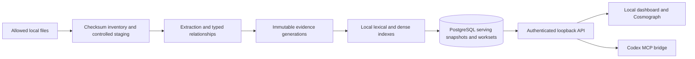

# Architecture

PostgreSQL is the durable source registry, job ledger and serving store. The evidence vault preserves content-addressed extraction/provenance artifacts. Published generations are immutable; the current workspace row binds a source revision to its publication. Runtime SQL roles have narrowly scoped table privileges; administrative schema migration is a separate launcher operation.

A checksum watcher detects changes. A PostgreSQL advisory lock elects one worker. Builds run outside the registry row lock; publication and source mutations serialize so a stale build cannot replace a newer revision. Evidence reads reconcile sources and require the current published revision. Worksets are bound to their publication and become unavailable after changes. This favors correctness over availability while rebuilding.

Discovery unions literal identifiers, lexical matches, dense neighbors and graph/structural context. Reciprocal rank fusion orders retained candidates. Local BGE-M3 embeddings and a multilingual BGE cross-encoder supply non-generative semantic signals. They are learned models, not LLM text-generation calls. Ranking controls order, not proof of irrelevance. The implementation lives in `evidencekg/src/evidencekg/hybrid/`.

Vespa and Neo4j are not required services in this release. The measured PoC retrieval and PostgreSQL implementation are retained; adding a second retrieval engine or graph database without a validated benefit would introduce migration and operational risk. Cosmograph visualizes API data without requiring a graph database.

The web API is a single-owner local boundary: strict loopback Host/Origin checks, bearer authentication for MCP, token-to-HttpOnly-cookie exchange for the browser, no wildcard CORS. Originals are read through a constrained source allowlist and copied before parsing. This does not isolate malicious file parsers from the user's OS account; run untrusted collections in an appropriately isolated host environment.

The product has no generative graph extraction or automatic benchmark grading. Codex analysis remains a separate user-requested reasoning step. Processing coverage, neighbor retrieval, evidence-bundle recall and final-answer correctness are distinct claims.

The graph uses locally bundled DuckDB WebAssembly. CSP permits WebAssembly compilation but not generic JavaScript string evaluation. Explicit non-null Arrow builders and direct Cosmograph color/size/link strategies avoid the dependencies' dynamic JavaScript code paths. No remote CDN or font is required.
