# What Graf adds to your documents

**Graf makes statements inside documents addressable, comparable and traceable.** Instead of only finding a passage, it can connect that passage to a shared calendar meaning, a candidate claim, its qualifications, related statements and its exact source. An LLM can then receive an evidence set that includes disagreement and uncertainty, alongside the original wording.

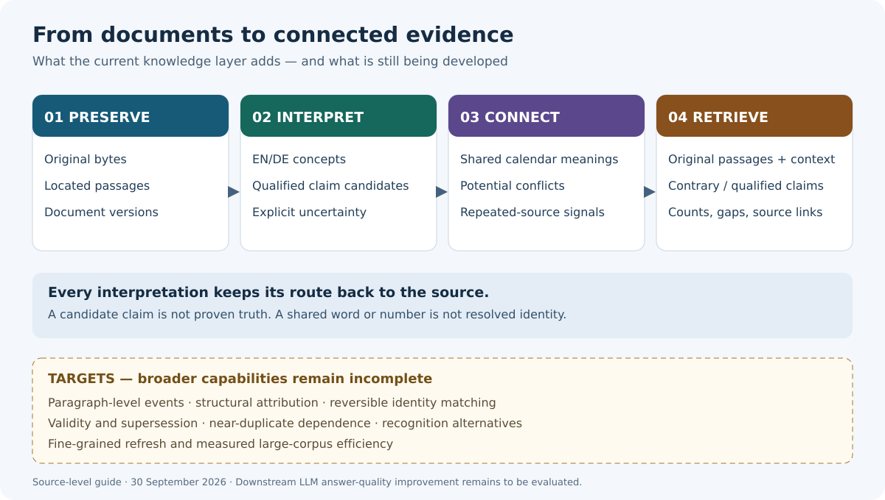

This guide explains the implementation inspected on **30 September 2026**, including uncommitted work. It is a source-level description, not confirmation that a running installation has published these features. Examples are illustrative; the small executable examples were checked against the current rules. Consult [Automatic knowledge](AUTOMATIC_KNOWLEDGE.md) for operational details.

**Reading the diagrams:** solid arrows show current transformations; dotted arrows show proposed capabilities or unresolved possibilities. “Current” means present in the inspected code. “Partial” means a foundation exists but the broader capability remains incomplete. “Target” describes development intent, not available behavior. The diagrams use Mermaid, supported by GitHub Markdown; the overview is a standalone SVG.

## 1. Why this is more than document retrieval

Imagine three files:

| Source | Original passage |
|---|---|
| A — English note | “Order 1847 was approved on 12 March 2026.” |
| B — German note | “Die Bestellung 1847 wurde am 12. März 2026 nicht genehmigt.” |
| C — plan | “Order 1847 will be approved only after inspection.” |

A document search can return useful passages. Graf's added knowledge layer explicitly represents how these passages relate:

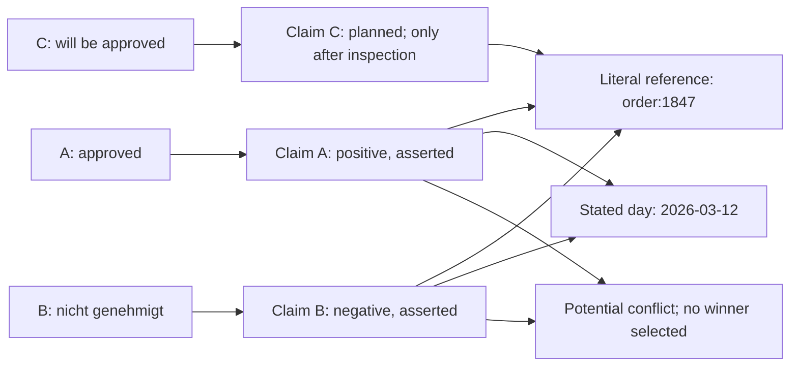

The added “knowledge” is a set of **explicit relationships with reasons**. It is not a declaration that approval happened. Even the shared order number is only a literal match: two companies could use the same number.

| An LLM needs to establish… | What the graph contributes |
|---|---|
| Are “March” and “März” relevant to the same month? | A shared calendar concept. |
| Does the passage describe an event, a plan or a requirement? | Separate modality and polarity fields for supported clauses. |
| Is there contrary evidence? | Negative statements and narrow potential-conflict groups. |
| Does approval depend on something? | The original condition, retained with the claim. |
| Can I check this interpretation? | Exact source spans, document versions and extraction identity. |
| Did retrieval omit anything? | Stored-match counts, coverage gaps and pagination continuations. |

These mechanisms can make evidence more useful. **Improved downstream answer accuracy has not yet been demonstrated by a representative evaluation.**

## 2. Language: different words can lead to the same concept

**Current: scoped bilingual vocabulary. Optional: local language and syntax models.**

The deterministic normalizer recognizes English and German forms and maps supported terms to shared keys. Original spelling and character positions stay attached.

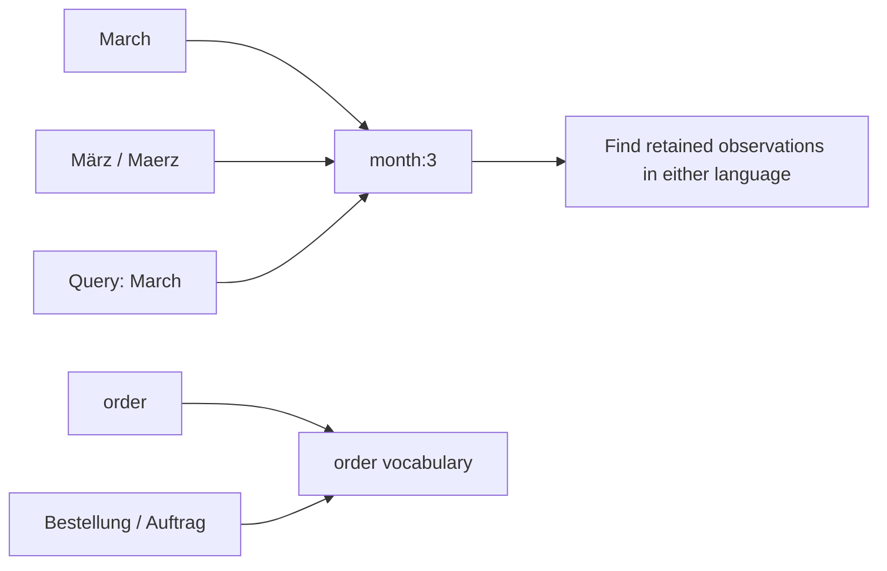

**Why it helps:** an English query can discover a German passage through a recognized concept, even though its literal words differ. This is scoped normalization, not general translation.

The optional Lingua model supplies English/German language hints. Both optional spaCy small CNN parsers remain eligible for a passage, so a German document containing an English quotation is not forced through just one language parser. They propose names and sentence structure; competing outputs remain visible. A language score is relative to these two languages, not a calibrated probability of correctness.

**Boundary:** matching a word to “approval” does not prove that anything was approved. A proposed person mention does not resolve who that person is. Optional syntax predictions are distinct from the excluded work on predicting new graph relationships.

Source: [language normalization](../evidencekg/src/evidencekg/knowledge_language.py), [optional NLP](../evidencekg/src/evidencekg/knowledge_nlp.py).

## 3. Dates: comparable meanings without invented precision

**Current: calendar normalization, precision, alternatives and calendar ordering.**

The date algorithm recognizes supported forms, validates the calendar date and emits its possible readings. An impossible date does not become a valid day.

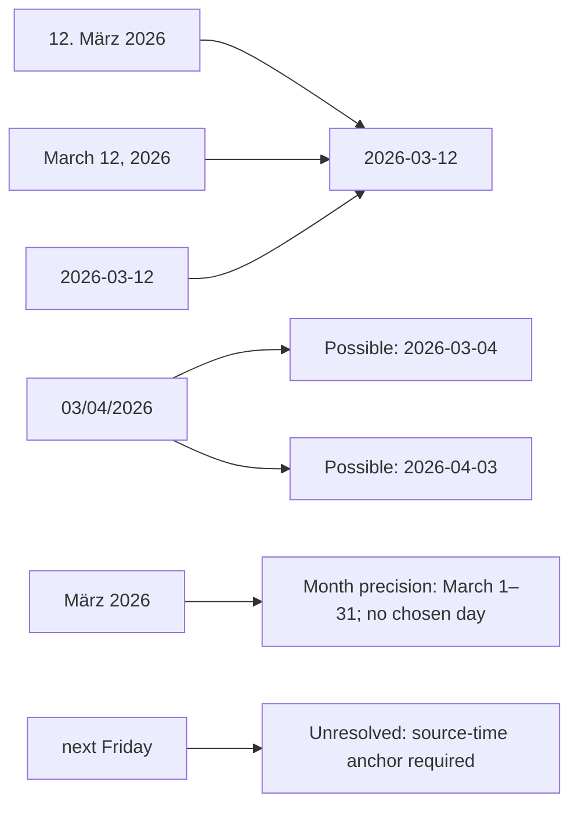

**Why it helps:** Graf can gather March evidence across languages, compare stated days and preserve uncertainty instead of silently choosing a date format. Numeric date observations keep alternative orderings; a recognized German claim can interpret a dotted date using German day-month-year rules.

Calendar ordering uses a small named rule:

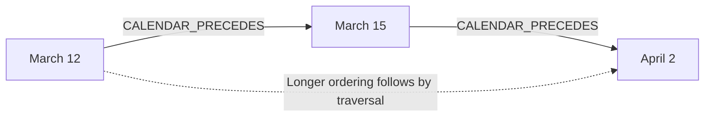

Each stored ordering carries the rule version and premise concept IDs. It proves calendar order only. It does not prove that an event occurred, caused another event or remained valid until the next date.

**Boundary:** “next Friday” is currently unresolved even when a useful anchor might exist elsewhere; general anchored relative-time reasoning remains development work. File ingestion time is never substituted for the source's intended time.

Source: [calendar rules and normalization](../evidencekg/src/evidencekg/knowledge_language.py), [graph derivation](../evidencekg/src/evidencekg/knowledge.py).

## 4. Amounts and identifiers: compare formats, preserve scope

**Current: decimal normalization, explicit currencies and typed literal identifiers.**

| Source text | Added representation | What remains unknown |
|---|---|---|
| `CHF 1’234.50` | Decimal value `1234.5`, currency CHF | Whether money actually moved. |
| `1.234,50 EUR` | Decimal value `1234.5`, currency EUR | Which event or account it belongs to. |
| `1,234` | Alternative values `1.234` and `1234` | Decimal versus grouping interpretation. |
| `$1234.50` | Decimal value `1234.5`, unresolved currency | Which dollar currency. |
| `Bestellung 1847` | Literal key `order:1847` | Which organization owns that order. |

**Why it helps:** formatting differences stop obscuring comparable values, while type information keeps an order reference distinct from an invoice reference. Exact decimal strings avoid introducing floating-point rounding into the extracted amount.

**Boundary:** an amount next to a payment sentence is not automatically its payment amount. Event-participant and amount attachment need additional evidence and extraction rules.

Source: [amount and identifier rules](../evidencekg/src/evidencekg/knowledge_language.py).

## 5. Claims and events: unpack who did what, with qualifications

**Partial: operational claim rules exist; broad paragraph-level event assembly is a target.**

Current rules match complete supported lines for approval, cancellation and payment. For example:

> Alice approved order 1847 on 12 March 2026 only after inspection.

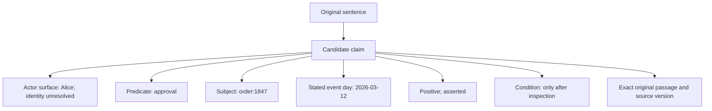

The difference between occurrence, possibility and obligation matters:

| Wording | Current interpretation |
|---|---|
| “was not approved” | Negative asserted candidate. |
| “will be approved” | Planned candidate. |
| “must not be approved” | Prohibition. |
| “muss nicht genehmigt werden” | Not required; proposition polarity unresolved. |
| “may not be approved” | Unresolved modal/negation reading. |

**Why it helps:** an LLM can distinguish a plan from an asserted event and see the condition beside the claim. “Only after inspection” remains part of the evidence rather than disappearing during summarization.

**Target transformation:** ordinary paragraphs → sentence and clause candidates → participants, negation, reported speech and conditions → source-bound event candidates. This would cover constructions outside the narrow whole-line rules. Optional dependency parsing supplies useful candidates today, but does not complete this transformation.

**Boundary:** questions, unsupported grammar and surrounding discourse do not become asserted operational claims. Several sentences on one line may yield observations but no operational claim. The source remains available; abstention is not evidence that nothing happened.

Source: [claim extraction](../evidencekg/src/evidencekg/knowledge.py), [language regression cases](../evidencekg/tests/test_knowledge_language.py).

## 6. Structure and attribution: who is actually saying this?

**Partial: source locators and basic quotation handling exist; rich structural meaning is a target.**

Consider a document containing these elements:

```text
Table header: Proposed payment
Cell:         EUR 5,000
Deleted text: Payment approved
Quotation:    Supplier wrote: “Payment approved.”
Qualification: Subject to board approval
```

Flattening all five into ordinary prose risks turning a proposal, deleted wording or somebody else's statement into the author's current assertion.

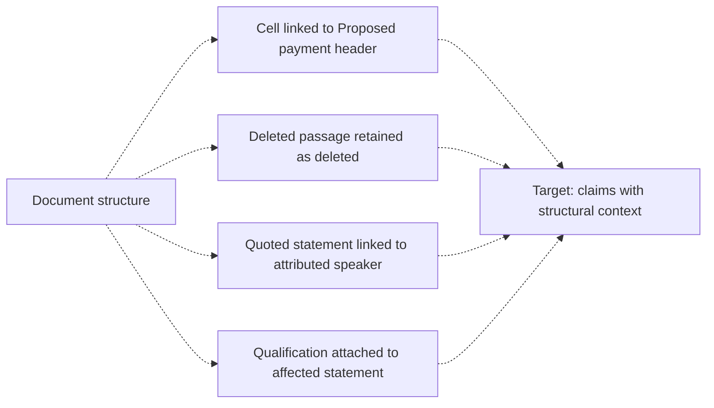

**Why it helps:** structure changes the interpretation of the same words. A table header may tell us that an amount is proposed; a deletion may show that wording was withdrawn.

**Current boundary:** format readers supply locators, and recognized quotation wrappers mark speaker attribution unresolved. DOCX revision semantics, PDF layout interpretation and complete speaker/quotation scope are still gaps. A link to a source document identifies provenance, not its author or speaker.

Sources: [format coverage](FILE_FORMATS.md), [document adapters](../evidencekg/src/evidencekg/parsers/documents.py), [current claim attribution](../evidencekg/src/evidencekg/knowledge.py).

## 7. Reversible entity resolution: connect references without erasing doubt

**Partial: literal references and name candidates exist; a multi-field identity resolver is a target.**

“ACME GmbH”, “Acme” and “the supplier” might refer to one organization. They might also refer to different organizations. A shared name alone does not settle this.

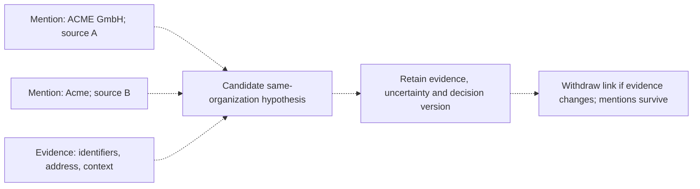

**Proposed algorithm:** generate plausible pairs using names or identifiers; compare independent fields and context; retain a source-backed match hypothesis. Leave ambiguous pairs unresolved. A chain of weak matches must not silently merge all participants.

**Why it helps:** supported matches would enable cross-document questions about one organization even when its name varies. Reversibility would let Graf correct a mistaken connection without destroying the original mentions or rewriting old snapshots.

**Current boundary:** `order:1847` groups literal references, not confirmed real-world orders. Optional name models supply mention candidates; there is no enabled probabilistic multi-field resolver. The dotted diagram is a design explanation, not a current algorithm claim.

Source: [entity and mention foundations](../evidencekg/src/evidencekg/knowledge.py), [name candidates](../evidencekg/src/evidencekg/knowledge_nlp.py).

## 8. Time and supersession: what was said to apply, and when?

**Partial: stated-day comparison exists; validity intervals and explicit supersession are targets.**

Three times can differ:

| Time | Example | Meaning |
|---|---|---|
| Event time | Approval on 12 March | When a source says an event happened. |
| Validity time | Policy applies from 1 April | When a statement or policy says it applies. |
| Recording time | Graf snapshot on 8 April | When Graf recorded this evidence state. |

A later document is not automatically more authoritative. Consider an amendment explicitly stating: “From 1 April, the limit is EUR 7,000, replacing section 4's EUR 5,000 limit.”

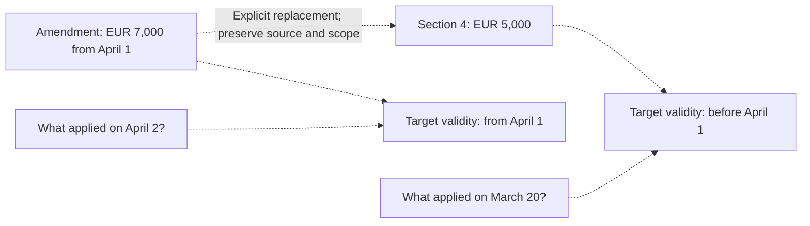

**Why it helps:** scoped validity and replacement evidence would let retrieval explain why an older statement applies to a historical question and why a later amendment changes a particular provision.

**Current boundary:** the field named `applicable_on` represents a stated event day. It is not a general validity interval. Evidence-set queries label stored dates before/same/after/unknown and retain them all. Explicit replacement, provision scope and anchored relative time remain incomplete.

Source: [query and temporal roles](../evidencekg/src/evidencekg/knowledge.py).

## 9. Conflicts and source dependence: disagreement and repetition are different

**Current: narrow potential conflicts and exact dependence signals. Target: near-duplicate and quotation dependence.**

A potential conflict group requires opposite asserted polarities with the same literal entity, predicate, actor surface and stated day. Qualified and quoted claims do not enter this narrow conflict rule. Different actors or dates may therefore escape conflict grouping even when their claims deserve comparison.

Dependence asks a different question: could several statements share the same source?

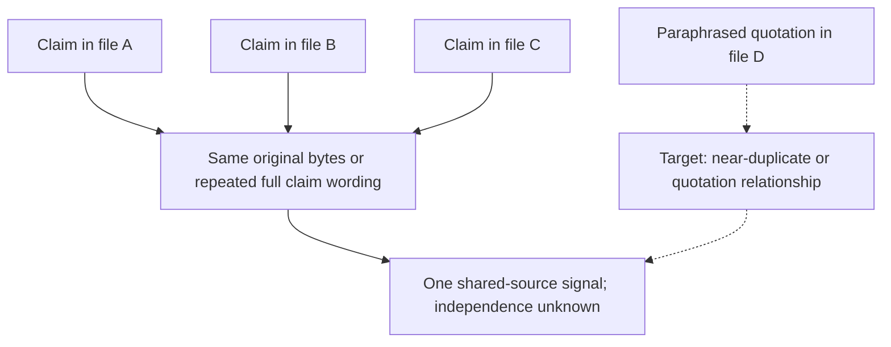

Current repeated-wording comparison normalizes whitespace. It is not general paraphrase detection. Even exact repetition does not prove which source copied which.

**Target transformation:** passages → candidate overlap comparisons → near-duplicate/quotation relationships with supporting spans. Overlap could flag dependence without inventing copying direction or treating all similar passages as one independent witness.

**Why it helps:** an LLM sees why ten retrieved documents may repeat one assertion. It also sees contrary claims without the graph choosing a winner. More graph paths do not mean more independent support.

Source: [conflict and dependence grouping](../evidencekg/src/evidencekg/knowledge.py).

## 10. Uncertain transcription: uncertainty must travel with the words

**Partial: source-bound diagnostics and withholding exist; real recognition alternatives and calibration remain targets.**

Imagine an audio span in which the recognizer could confuse “fifteen” and “fifty”. The alternatives below illustrate the intended behavior; Graf does not currently invent or supply that alternative pair.

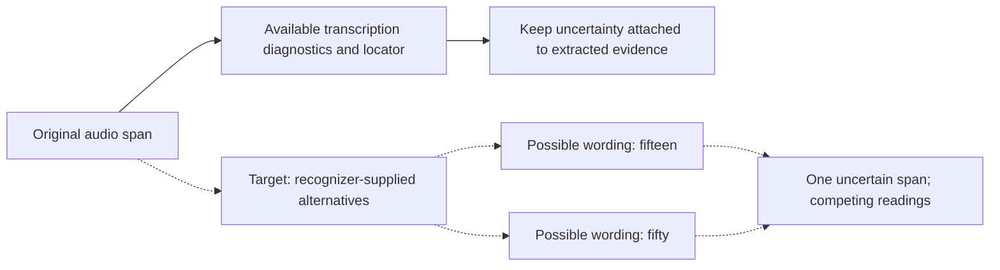

**Why it helps:** uncertainty in an amount, name or negation can change an entire claim. Retaining genuine alternatives would let downstream reasoning see where a conclusion depends on uncertain recognition.

Keep these questions separate:

| Dimension | Question |
|---|---|
| Transcription | Were the words heard correctly? |
| Extraction | Were those words interpreted correctly? |
| Identity | Does this mention refer to that entity? |
| Relevance | Does this passage help answer the question? |
| Truth | Is the statement actually true? |

**Current boundary:** unknown calibrated probabilities remain `null`. Decoder scores are not truth probabilities. Withheld speech stays withheld, and date/amount reading alternatives are not ASR alternatives. Recognition lattices and calibration require actual recognizer outputs and suitable reference data.

Sources: [transcription behavior](TRANSCRIPTION.md), [transcription adapter](../evidencekg/src/evidencekg/parsers/transcription.py), [uncertainty propagation](../evidencekg/src/evidencekg/knowledge.py).

## 11. Provenance and refresh: every interpretation has a history

**Current: exact source binding, version signatures and immutable generations. Target: finer-grained recomputation.**

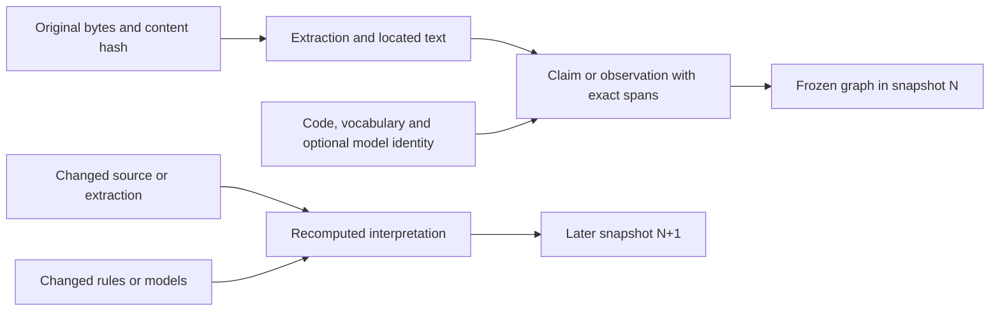

**Why it helps:** a result can be checked against the exact passage and the interpretation rules that produced it. When a premise disappears, later snapshots can lose its derived relationships while historical snapshots retain their original evidence.

Current enrichment reuse requires the same extraction identity and complete implementation/model signature. This avoids reusing an interpretation after its rules change. Verification checks artifacts, spans and graph structure and can repeat derivation with the matching implementation.

**Target transformation:** track which individual claims and proofs depend on each changed premise, then recompute the affected portion. This would reduce refresh work without leaving stale conclusions. General fine-grained, multi-proof recomputation is not implemented; dashboard publication still has its existing full lifecycle.

Source: [enrichment, freezing and verification](../evidencekg/src/evidencekg/knowledge.py).

## 12. Storage: keep the meaning affordable to retain

**Partial: bounded compression and compact relationship patterns exist; large-corpus efficiency remains unproven.**

A graph can be much larger than its input because it stores statements, offsets, provenance, concepts, edges and version metadata. Three current techniques address parts of that cost:


1. **Compress knowledge artifacts.** The current storage helper uses zlib and reads earlier uncompressed generations. Original evidence storage is unchanged. Compression reduces repeated representation; it adds no semantic knowledge.
2. **Group related claims through a group node.** For a group with *n* members, store *n* membership edges rather than every pair.
3. **Store adjacent calendar order.** For *n* distinct day concepts, store *n − 1* ordering edges; longer order follows by traversal.

| Illustrative node count | Every unordered pair | Group membership edges | Adjacent calendar edges |
|---|---:|---:|---:|
| 10 | 45 | 10 | 9 |
| 100 | 4,950 | 100 | 99 |
| 1,000 | 499,500 | 1,000 | 999 |

This table is arithmetic, **not a benchmark**. Group membership and calendar ordering solve different relationship problems; the comparison illustrates their storage shapes.

**Why it helps:** lower storage and refresh cost can make more evidence practical to retain. It does not establish higher extraction accuracy. Compression does not remove the cost of materializing or querying the decoded graph.

The older single-run synthetic measurements in [Automatic knowledge](AUTOMATIC_KNOWLEDGE.md) show substantial amplification. They should not be read as a fresh measurement of the current compressed implementation. No new compression ratio, throughput gain or million-document capacity is claimed here.

Sources: [compressed storage](../evidencekg/src/evidencekg/knowledge_storage.py), [graph construction](../evidencekg/src/evidencekg/knowledge.py).

## 13. What the LLM actually receives

**Current: structured knowledge queries and annotations alongside original passages.**

The read-only knowledge query is available through MCP, CLI and HTTP. Hybrid discovery can use shared bilingual concepts and claim context, while retrieval still supplies original text.

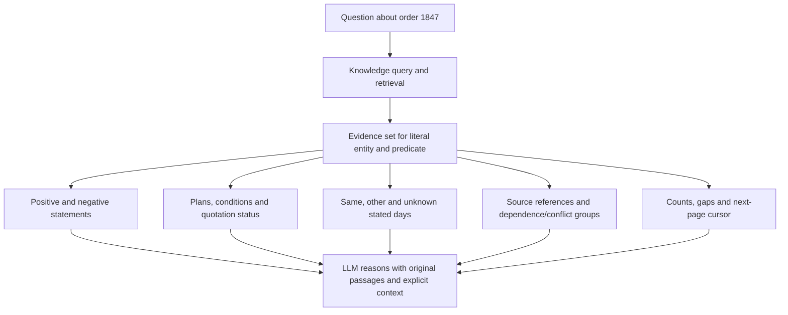

For the three opening passages, a useful answer could say:

> The English note says the order was approved on 12 March. The German note says it was not approved on that day. A separate plan makes approval conditional on inspection. These sources do not establish an uncontested approval.

That is an **illustrative answer**, not a measured model result. The graph provides the ingredients and source links; it cannot guarantee that a model uses them correctly.

An evidence-set query preserves all stored claims for the literal entity and requested predicate across pages. A requested day supplies comparison roles rather than dropping other-day or unknown-day claims. An exact claim-day filter has a narrower contract. All continuation cursors must be followed for the complete stored set.

**Boundary:** complete stored results do not mean complete understanding of every document. Extraction budgets, unsupported grammar and missing models can leave visible coverage gaps. Discovery and context bundles have their own limits. The detailed Workspace Graph exposes knowledge records and their source references; the simpler document graph does not show all this structure.

Sources: [knowledge query](../evidencekg/src/evidencekg/knowledge.py), [hybrid retrieval](../evidencekg/src/evidencekg/hybrid/retrieval.py), [Workspace Graph](../product/ui/src/WorkspaceGraph.svelte).

## 14. What is delivered, what remains, and how to measure value

| Capability | Inspected implementation | Remaining semantic improvement |
|---|---|---|
| English/German meaning | Shared vocabulary, dates, amounts; optional local name/syntax candidates | Broader reliable paragraph-level extraction. |
| Claims/events | Qualified operational candidates | Rich participant/event assembly and discourse scope. |
| Structure/attribution | Locators and unresolved quotation marking | Revisions, layout, headers and speaker scope. |
| Entity identity | Literal keys and uncertain mentions | Reversible evidence-backed multi-field matching. |
| Time | Stated days, alternatives, calendar proofs and comparison roles | Validity intervals, anchored relative time and scoped supersession. |
| Dependence | Same-byte and repeated-wording groups | Near-duplicates and quotation relationships. |
| Transcription uncertainty | Diagnostics, withholding and separate uncertainty dimensions | Actual recognition alternatives and reference-based calibration. |
| Storage/refresh | Compression, compact edge patterns, signature-based reuse | Measured large-corpus serving and fine-grained recomputation. |
| LLM evidence | Original passages plus typed context, source references and receipts | Independent evidence that downstream answers improve. |

**Graph prediction and automatic rule mining remain out of scope.** The named calendar-order rule is hand-written and bounded. Conventional name/syntax predictions describe text candidates; they do not infer missing real-world graph facts.

The relevant [core](../evidencekg/tests/test_knowledge.py), [bilingual](../evidencekg/tests/test_knowledge_language.py), [integration](../evidencekg/tests/test_knowledge_integration.py) and [live retrieval](../evidencekg/tests/test_knowledge_live.py) tests exercise implementation contracts. Their existence is not a claim that every suite was rerun for this documentation change.

To establish the practical benefit, compare the same questions and source snapshot with and without graph context, holding the model and retrieval budget fixed. Use independently reviewed English/German cases covering negation, conditions, attribution, identity, time and repeated sources. Measure supported-answer accuracy, omitted contrary evidence, citation correctness, appropriate abstention, storage and latency. Keep failures and unresolved cases in the denominator.

The intended improvement is concrete: **find related evidence across wording differences, preserve what each source actually says, expose disagreement and uncertainty, and make every interpretation checkable.**
